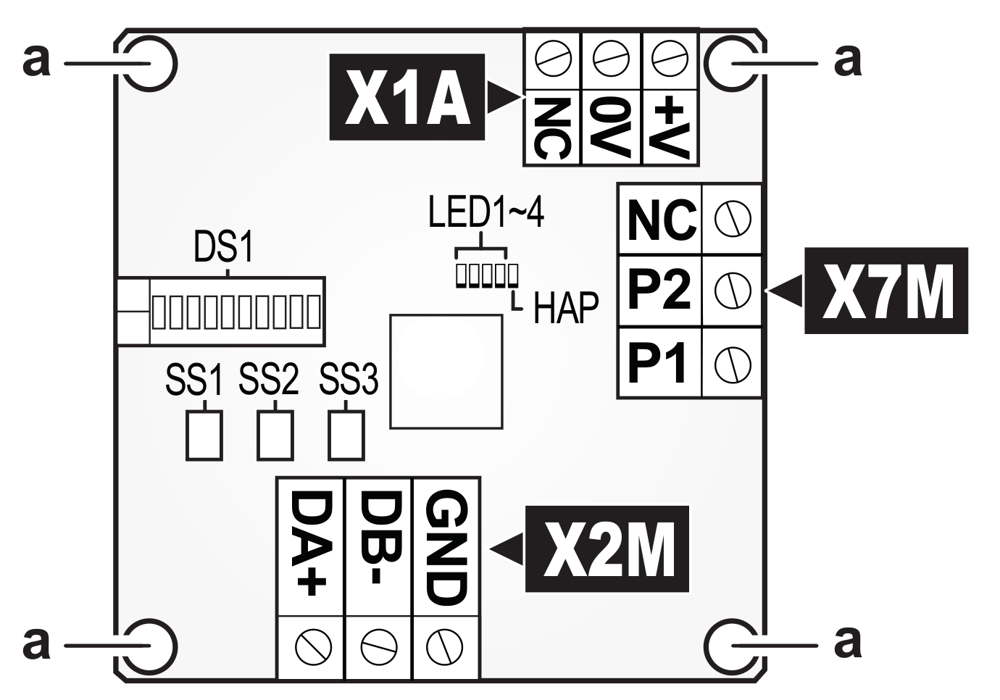
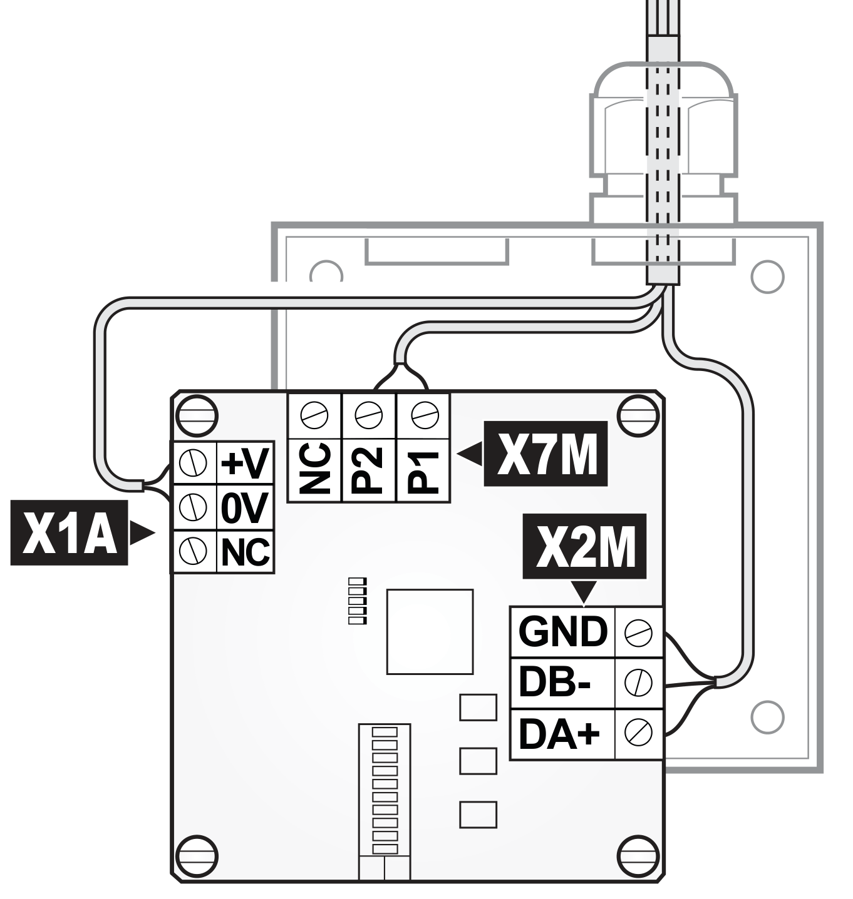
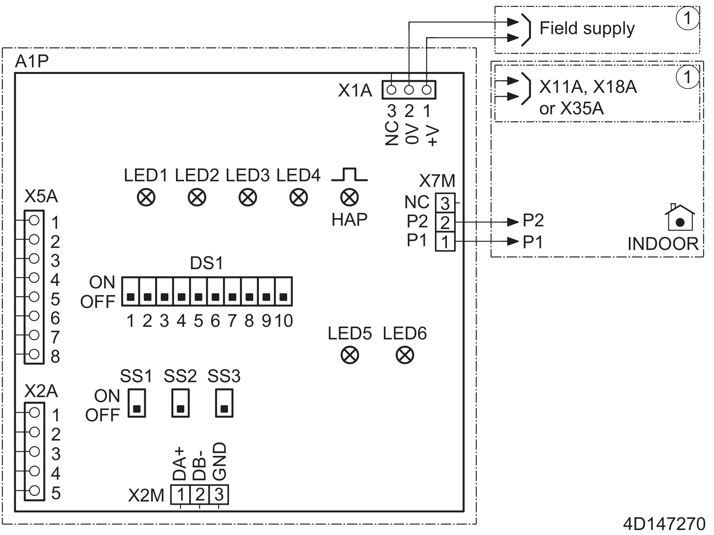
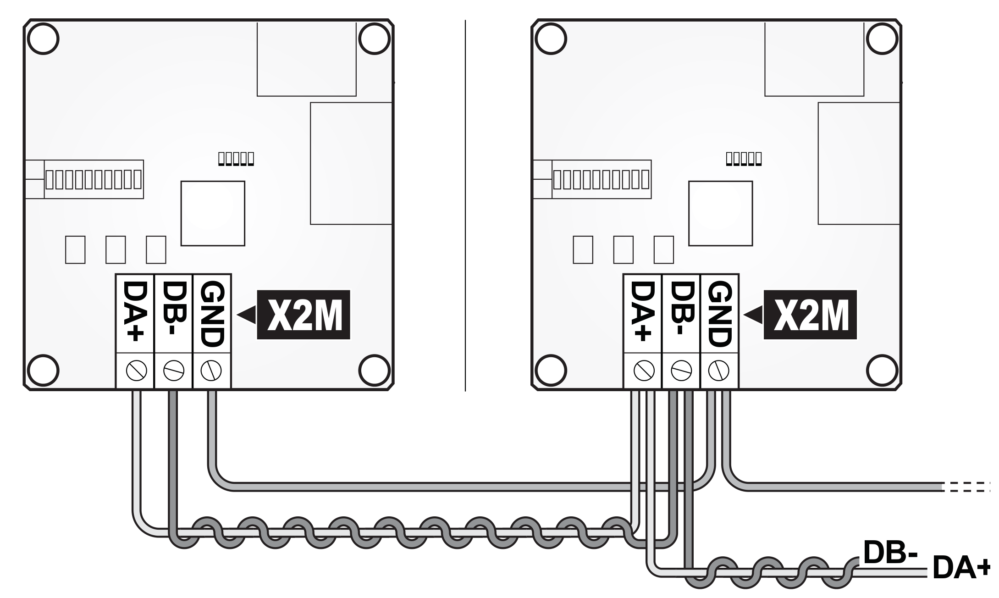
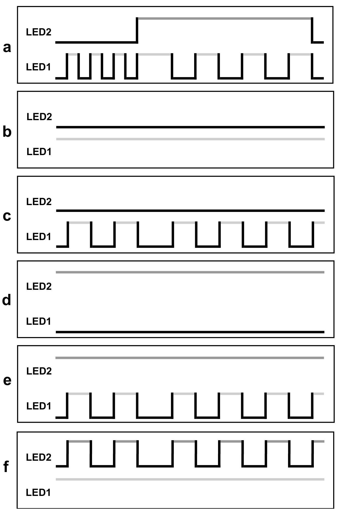

# Daikin EKMBPP1/EKMBPP1A - Inštalačná príručka pre TapHome

## Podporované modely

**Modbus adaptér:** EKMBPP1, EKMBPP1A

**Kompatibilné systémy:**
- VRV klimatizačné jednotky
- Sky Air klimatizačné jednotky
- VAM a VKM ventilačné jednotky

**Poznámka:** Adaptér je kompatibilný so všetkými jednotkami s P1P2 pripojením pre diaľkový ovládač.

---

## 1. Inštalácia hardvéru

### 1.1 Prehľad PCB a komponentov



**Kľúčové komponenty:**
- **X1A** - Napájací konektor (15-24V DC)
- **X2M** - RS-485 Modbus konektor (DA+, DB-, GND)
- **X7M** - P1P2 komunikácia s klimatizačnou jednotkou
- **DS1** - 10-polohový DIP switch pre Modbus adresu
- **SS1, SS2, SS3** - Slide switches pre terminačný odpor
- **LED1-4, HAP** - Stavové LED indikátory

### 1.2 Technické parametre
- **Napájanie:** 15-24 V DC, max 120 mA (3 W)
- **Prevádzková teplota:** -10°C až +50°C
- **Modbus protokol:** RTU Slave, RS-485
- **Rýchlosť:** 9600 baud, žiadna parita, 1 stop bit
- **Max. počet jednotiek:** 16 v jednej skupine

### 1.3 Pripojenie Modbus RTU

#### RS-485 Modbus (X2M konektor)
Pre pripojenie k TapHome použite **3-vodičové RS-485 pripojenie**:

- **DA+:** Data A (pozitívna) → pripojte na A+/D+ TapHome RS-485
- **DB-:** Data B (negatívna) → pripojte na B-/D- TapHome RS-485
- **GND:** Spoločná zem → **POVINNE pripojte na GND TapHome napájacieho zdroja**



**Príklad zapojenia vo vnútri KRP1BC101 boxu:**
- Káble sú vedené cez káblové priechodky v hornej časti boxu
- Spoločný heat-shrink tubing pre všetky tri káble (DA+, DB-, GND)
- Jednotlivé káble sa rozvetvujú na PCB ku konektoru X2M

**Špecifikácia kábla:**
- Typ: 24 AWG krútená dvojlinka (twisted pair), tienená alebo netienená
- Štandard: CAT3, CAT4 alebo CAT5
- Maximálna dĺžka: **500 m**
- Použite krútenú dvojlinku pre DA+/DB- a tretiu žilu pre GND

⚠️ **DÔLEŽITÉ - Uzemnenie:**
- GND vodič **MUSÍ** byť prepojený medzi Daikin adaptérom a TapHome napájacím zdrojom
- Bez správneho uzemnenia môže dochádzať k poruchám komunikácie
- Odporúčame zapojiť GND na jednom mieste (single point grounding)



**Elektrická schéma:**
- Zobrazuje všetky konektory: X1A (napájanie), X2M (RS-485), X7M (P1P2)
- Pripojenie na vnútornú jednotku cez P1/P2 terminály
- DIP switch DS1 a slide switches SS1-SS3 pozície

---

## 2. Konfigurácia Modbus

### 2.1 Nastavenie adresy (DIP switch)

Na PCB sa nachádza 10-polohový DIP switch označený **DS1**, ktorý určuje Modbus RTU Slave adresu (0-63).

**Príklady nastavenia adries 1-10:**

| Adresa | DIP Switch DS1 (1→10) |
|--------|----------------------|
| **1** | `⬜⬜⬜⬜⬜⬜⬜⬜⬜🟦` |
| **2** | `⬜⬜⬜⬜⬜⬜⬜⬜🟦⬜` |
| **3** | `⬜⬜⬜⬜⬜⬜⬜⬜🟦🟦` |
| **4** | `⬜⬜⬜⬜⬜⬜⬜🟦⬜⬜` |
| **5** | `⬜⬜⬜⬜⬜⬜⬜🟦⬜🟦` |
| **6** | `⬜⬜⬜⬜⬜⬜⬜🟦🟦⬜` |
| **7** | `⬜⬜⬜⬜⬜⬜⬜🟦🟦🟦` |
| **8** | `⬜⬜⬜⬜⬜⬜🟦⬜⬜⬜` |
| **9** | `⬜⬜⬜⬜⬜⬜🟦⬜⬜🟦` |
| **10** | `⬜⬜⬜⬜⬜⬜🟦⬜🟦⬜` |

**Legenda:** ⬜ = OFF (dole), 🟦 = ON (hore)

**Poznámka:** DIP switch 10 je najnižší bit (LSB), čítame sprava doľava.

**Štandardne pre TapHome odporúčame:**
- **Adresa 1** pre prvý adaptér (DIP 10=ON, ostatné OFF)

⚠️ **Poznámka:** Kompletná tabuľka všetkých 64 adries je na str. 36 PDF manuálu.

### 2.2 Terminačný odpor (SS1-SS3)

| SS1 | SS2 | SS3 | Odpor |
|-----|-----|-----|-------|
| OFF | OFF | OFF | 0Ω |
| OFF | ON | OFF | 100Ω |
| OFF | ON | ON | **120Ω** |

⚠️ **Pre TapHome:**
- TapHome Core má vstavaný **120Ω** odpor na BUS termináloch
- Nastavte **120Ω** (SS1=OFF, SS2=ON, SS3=ON) **iba na poslednej** Daikin jednotke v zbernici
- Všetky ostatné jednotky: **0Ω** (SS1=OFF, SS2=OFF, SS3=OFF)

### 2.3 Nastavenie Slave ID v TapHome

⚠️ **DÔLEŽITÉ - Pre Slave ID rôzne od 1:**

Ak používate **Slave ID inú ako 1** (napr. 2, 3, atď.), musíte v TapHome **upraviť ReadScript registre** pre správne čítanie chýb a alarmov.

**Vzorec pre prepočet:**
- **Register pre chybu jednotky:** `SlaveID × 100 + 21`
- **Register pre alarm filtra:** `SlaveID × 100 + 24`

**Príklady:**

| Slave ID | Register chyby | Register alarmu | Poznámka |
|----------|---------------|----------------|----------|
| 1 | 121 | 124 | ✅ Predvolené (netreba meniť) |
| 2 | 221 | 224 | Je nutné upraviť v TapHome |
| 3 | 321 | 324 | Je nutné upraviť v TapHome |
| 10 | 1021 | 1024 | Je nutné upraviť v TapHome |

**Kde upraviť v TapHome:**
1. Otvorte modul "Daikin EKMBPP1"
2. V servisných nastaveniach nájdite **ReadScript**
3. Zmeňte hodnoty registrov podľa vyššie uvedeného vzorca

**Príklad pre Slave ID = 2:**
```
Pôvodné: MODBUSR(A, 121, Uint16)
Zmenené: MODBUSR(A, 221, Uint16)
```

⚠️ **Toto platí pre VŠETKY čítané registre väčšie ako 100!**

### 2.4 Modbus Master Timeout

**Pre TapHome nastavte DIP 3-4:**
```
DIP 3: ON
DIP 4: OFF
```

Toto nastavenie:
- Po 120 sekundách bez Modbus komunikácie zapne všetky jednotky s aktuálnym nastavením
- Odomkne diaľkové ovládače
- Nastaví Global Update na "OnChange"

---

## 3. Status LED indikátory

Po zapnutí sledujte LED diódy na PCB:



| LED | Farba | Význam |
|-----|-------|--------|
| LED1 | Zelená | Indikuje stav adaptéra |
| LED2 | Červená | Indikuje chyby |
| LED3 | - | Bliká pri P1P2 komunikácii |
| LED4 | - | Bliká pri Modbus komunikácii |
| HAP | - | Bliká každých 400 ms (normálna prevádzka) |

**Normálny stav:**
- LED1: Zelená svieti trvale
- LED2: Červená nesvieti
- LED3/LED4: Blikajú pri komunikácii
- HAP: Pravidelné blikanie



**Chybové stavy:**
- **a) Power-up sequence:** LED1 bliká rýchlo, LED2 bliká
- **b) No error:** LED1 svietí trvale (zelená), LED2 nesvieti
- **c) P1P2 search mode:** LED1 bliká pomaly, LED2 svieti (hľadá jednotky)
- **d) Unit error:** LED2 svieti trvale, LED1 nesvieti (chyba jednotky)
- **e) U5 error:** LED1 bliká, LED2 nesvieti (AC jednotka chýba)
- **f) RS-485 timeout:** LED2 bliká, LED1 nesvieti (Modbus komunikačný timeout)

---

## 4. Dostupné funkcie v TapHome

**Kontrolné zariadenia:**
- Teplomer vratného vzduchu (priemer/min/max)
- Nastavenie teploty (16-32°C)
- Rýchlosť ventilátora (Nízka/Stredne nízka/Stredná/Stredne vysoká/Vysoká)
- Prevádzkový režim (Auto/Vykurovanie/Ventilácia/Chladenie/Odvlhčenie)
- Smer prúdenia vzduchu (Natočenie/0°/20°/45°/70°/90°)
- Zapnutie/Vypnutie
- Smart Grid režim (Volný/Nuc. vypnutie/Doporučené zap./Nuc. zapnutie)

**Servisné atribúty:**
- Stav jednotky (Nájdená/Nenájdená)
- Termo stav (Nečinnosť/Vykurovanie/Chladenie)
- Odmrazovanie
- Chyba jednotky + kód chyby
- Alarm filtra

---

## 5. Riešenie problémov

### Jednotka sa nenašla (LED1 bliká)
1. Skontrolujte P1P2 káble
2. Overte, že jednotka je zapnutá
3. Skúste reštartovať adaptér (odpojte/pripojte napájanie)

### Žiadna Modbus RTU komunikácia (LED4 nebliká)
1. **Skontrolujte RS-485 káble:**
   - DA+ správne pripojené na A+/D+ TapHome
   - DB- správne pripojené na B-/D- TapHome
   - **GND pripojené na zem TapHome napájacieho zdroja** ← Najčastejší problém!
2. Overte Modbus Slave adresu na DIP switchi DS1
3. Skontrolujte terminačný odpor (SS1, SS2, SS3) - prvá/posledná jednotka = 120Ω
4. Overte, že TapHome má nastavené: 9600 baud, no parity, 1 stop bit
5. Zmerajte napätie medzi DA+ a DB- - malo by byť 1,5-5V pri idle stave

### Chyba jednotky (LED2 svieti)
1. Prečítajte register I0022 (Error Code)
2. Pozrite kód chyby v manuáli klimatizácie
3. Skontrolujte servisné atribúty v TapHome

### Timeout Modbus Master (LED2 bliká)
1. Overte, že TapHome pravidelne číta/zapisuje registre
2. Skontrolujte DIP switch 3-4 pre timeout nastavenie
3. Zvážte použitie iného timeout režimu

---

*Dokumentácia vygenerovaná pre TapHome inštalačného partnera*
*Verzia: 2.1 | Dátum: 2025-01-20*
*Základná príručka: Daikin 4P720139-1C*
